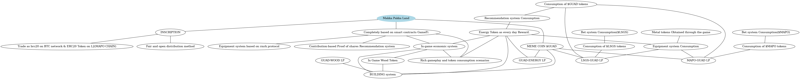

Makka Pakka Land is a GameFi project, a collection of many gameplays.

# featrues
- Betting system: Players can win in-game NFT/consumable resources (stamina/materials) and other precious game props by betting using $mapo / $LSGS. The betting proceeds will be added to the MAPO_GUAD trading pair

- Combat system: Players can enhance their own strength and challenge other players to obtain each other's resources.

- Breeding system: Players can enhance the attributes of their pets through breeding and fight side by side with their pets.

- Recommendation system: Recommend your friends to join the game and form a legion to achieve great success in the game. Receive resources every day based on player contributions.

More gameplays are being designed.

# Mind Map
- We release the first version of our Game Planning Mind Map
- 